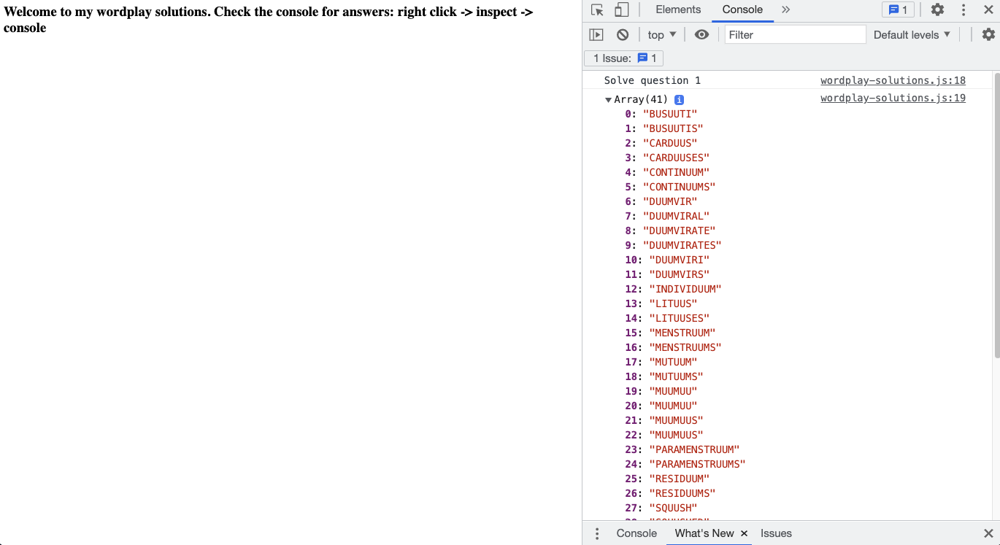

## Wordplay Solutions in Javascript

Here's how this solution template works:

1. index.html loads `sowpods.js` which contains an array named `wordBank` containing all of the words
2. index.html loads `wordplay-solutions.js` which uses `wordBank` to solve question one.

## Where is my answer?

`wordplay-solutions.js` logs to the console, so you can open developer tools to see its output.

